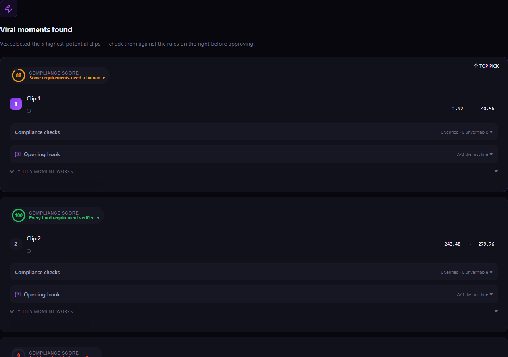
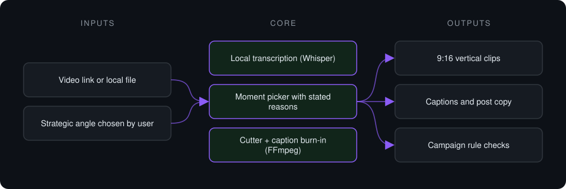
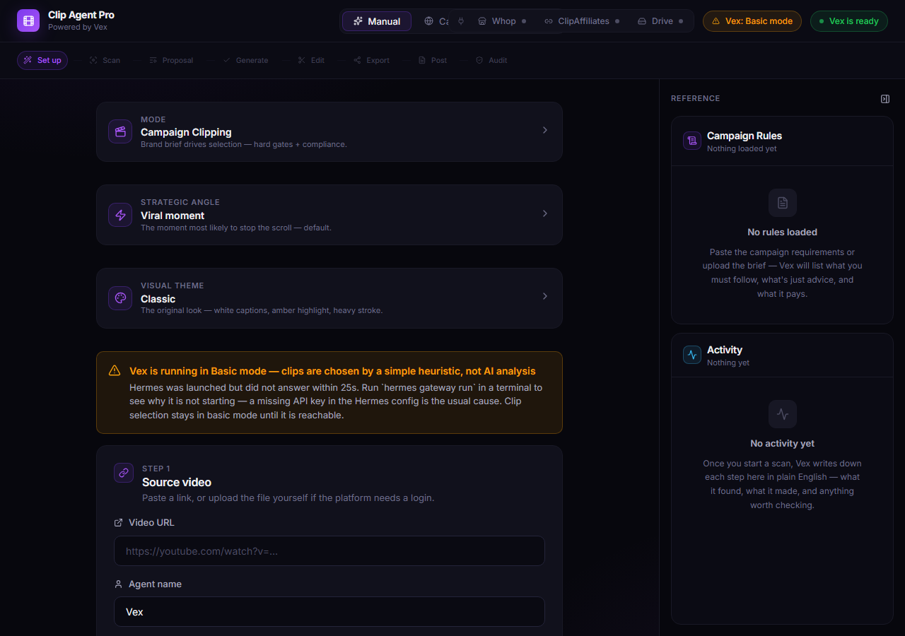
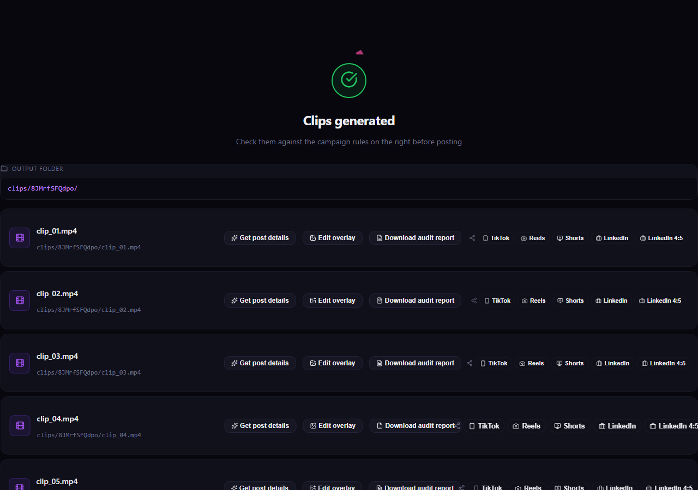

# Clip Agent Pro

**Desktop app that turns long videos into captioned vertical clips: transcribe, pick the moments worth cutting, cut, caption and export.**

> **This is a proprietary project. Source code is private. This page showcases the system's architecture and results.**

**Case study page:** [https://jryahia.github.io/showcase-clip-agent-pro/](https://jryahia.github.io/showcase-clip-agent-pro/)

## Problem it solves

Cutting short-form clips from podcasts, streams and interviews is slow manual work: scrubbing timelines, cutting, re-framing to 9:16, adding captions and writing copy. Clip Agent Pro does the whole chain in one local desktop app, and the user approves every proposed clip before a frame is encoded.

## Architecture

1. The user provides a link or file; media is downloaded and transcribed locally.
2. The clip picker scores moments against the chosen angle and proposes ranges, each with a reason.
3. The user approves or edits proposals in a mini editor.
4. Approved ranges are cut, re-framed to 9:16 and captioned in a single pass, then exported per platform.

## Key features

- Two engines: viral short-form picking and long-form dead-air removal
- Human approval step before any encoding
- Non-contiguous moments joined into one deliverable with crossfades
- Burned-in captions and generated post copy
- Campaign compliance check against platform rules
- Runs locally as a desktop app

## Tech stack

     

## What it does in practice

- Replaces a manual cut-caption-export loop with one guided flow inside a single app.
- Keeps media on the user's machine: transcription and rendering run locally.

## Screenshots

**Clip proposals, each with a stated reason**

**Job setup: source, mode and campaign**

**Mode selector**

**Finished clips and per-platform exports**

---

Built by [Yahya Jarray](https://github.com/jryahia). Interested in a similar system? [Get in touch](mailto:yahiajarray43@gmail.com).

This repository contains no source code. It is a case study for a proprietary project. © Yahya Jarray.
